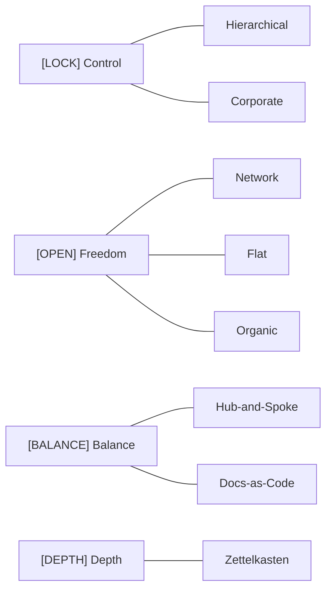

The choice of architectural approach determines how navigation is organized, who can make edits and how, and how the system will scale. Below are 8 core approaches, ranging from strict hierarchy to Docs-as-Code freedom.

## Approaches Map

## Summary Table

| Approach | Structure | Flexibility | Scalability | Maintenance Complexity |
|----------|-----------|-------------|-------------|----------------------|
| Hierarchical | Tree | Low | Medium | Low |
| Network | Graph | High | High | Medium |
| Hub-and-Spoke | Hybrid | Medium | High | Medium |
| Flat | None | Maximum | Low | Low |
| Zettelkasten | Graph | High | Medium | High |
| Corporate | Tree | Minimal | High | High |
| Organic | Chaos → Clusters | Maximum | Low | High |
| Docs-as-Code | Files + Git | Medium | High | Medium |

**How to choose an approach:** Most projects eventually converge on a **hybrid**: top-level hierarchy + networked links within. For more details, see the "System Selection" section.
