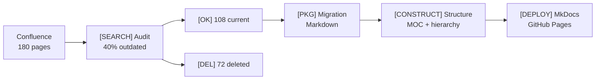

A case study of migrating documentation from Confluence to MkDocs. A real-world example of transitioning from a corporate Wiki to Docs-as-Code.

## Context

A company with 50+ developers used Confluence for documentation. Over 3 years, 180 pages accumulated, of which 40% were outdated. Onboarding new developers took 3 weeks due to documentation chaos.

## Confluence Problems

- **40% outdated pages** — no one removed unnecessary content
- **Slow search** — Confluence Search could not find obvious pages
- **No review** — anyone could edit, quality was uncontrolled
- **Expensive** — $7/user/month × 50 users = $350/month

## Solution: Hybrid Approach



## Migration Process

1. **Audit** (1 week) — found 72 outdated pages, 30 duplicates
2. **Restructuring** (1 week) — designed a MOC structure instead of flat
3. **Conversion** (1.5 weeks) — Markdown conversion + manual proofreading
4. **CI/CD Setup** (0.5 weeks) — GitHub Actions + mkdocs build --strict
5. **Launch** — deployment to GitHub Pages

## Results

| Metric | Confluence | MkDocs |
|--------|------------|--------|
| Outdated pages | 40% | 5% |
| Onboarding time | 3 weeks | 1 week |
| Hosting | $350/month | $0 |
| Change review | None | PR review |
| Time to find information | ~5 minutes | ~1 minute |

## Post-Migration Structure

```text
docs/
  index.md              # Home (MOC)
  approaches/           # Approaches
    index.md            # MOC: approaches
    hierarchical.md
    network.md
    hub-and-spoke.md
  tools/                # Tools
    index.md            # MOC: tools
    mkdocs.md
    gitbook.md
  cases/                # Case Studies
    confluence-to-mkdocs.md
```

## Lessons Learned

1. **Start with an audit** — do not migrate garbage
2. **Restructure before migrating** — do not copy the old structure
3. **Set up CI/CD immediately** — `mkdocs build --strict` catches broken links
4. **Assign section owners** — otherwise documentation will become outdated again

**Bottom line:** 4-5 weeks for migration, but the result is documentation that people actually use.
