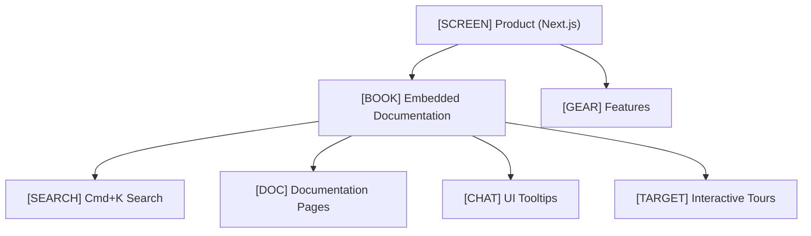

Documentation inside a Next.js application. Instead of a separate documentation site — a full-fledged documentation portal embedded in the product.

## What Are Product-Embedded Docs

This is an approach where documentation is part of the product itself, not a separate site. The user gets help **without leaving** the application.



## Tech Stack (ZCode)

| Component | Technology |
|-----------|------------|
| Framework | Next.js 16 App Router |
| Rendering | SSR (Server-Side Rendering) |
| Styling | Tailwind CSS |
| Internationalization | next-intl |
| Search | Cmd+K dialog |
| Content | Markdown / MDX |

## Approach Comparison

| Aspect | MkDocs (separate site) | GitBook (SaaS) | Product-Embedded (ZCode) |
|--------|------------------------|----------------|--------------------------|
| Location | Separate domain | gitbook.io | Inside the product |
| Control | Full | Limited | Full |
| Authorization | Separate | Platform-based | Native (product session) |
| Updates | CI/CD | Manual / Git sync | Product deployment |
| Customization | Theme | Limited | Unlimited |
| Maintenance cost | Low | Medium | High |
| Entry barrier | Medium | Low | High |

## Pros of Product-Embedded

- **Single codebase** — documentation and product in one repository
- **Full control** over design, navigation, and functionality
- **Native authorization** — the user is already logged in, no separate access needed
- **Contextual help** — show documentation relevant to the current page
- **MDX components** — interactive examples, live code, widgets

## Cons of Product-Embedded

- **Expensive** — requires a frontend developer for maintenance
- **Framework lock-in** — migrating away from Next.js will be painful
- **Harder for non-technical authors** — requires Git, Markdown, React understanding
- **Development time** — 2-4 weeks for a documentation portal MVP

## MDX as a Compromise

MDX allows writing Markdown with React components. This provides interactivity without sacrificing simplicity:

```mdx
# API Setup

To get started, you will need an API key.

<ApiKeyGenerator />

Copy the key and add it to your configuration:

```bash
export API_KEY="your-key-here"
```

<Callout type="warning">
Never commit API keys to Git!
</Callout>
```

**Recommendation:** If you have frontend development resources and the product is complex enough — Product-Embedded Docs is the best approach. For simpler projects — MkDocs is more reliable and cheaper.
