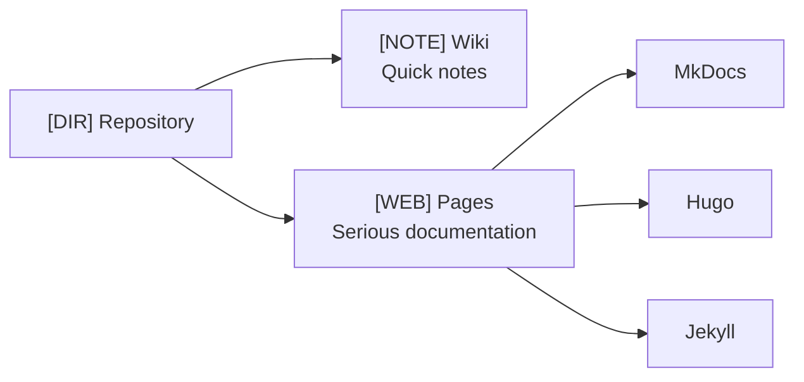

GitHub provides two mechanisms for documentation: Wiki and Pages. They solve different problems and are suited for different scenarios.

## GitHub Wiki

A built-in Wiki in every repository. Simple editor, change history, Markdown.

- **Pros:** Built into the repository, low entry barrier, edit history
- **Cons:** Flat structure, limited navigation, no customization, poorly indexed

## GitHub Pages

Static hosting for sites (documentation, landing pages, blogs). Supports Jekyll, but any generator can be used.

- **Pros:** Full control, custom domain, SEO, any generator
- **Cons:** Need to set up CI/CD, need a generator (MkDocs, Hugo), no visual editor

## Comparison

| Aspect | GitHub Wiki | GitHub Pages |
|--------|-------------|--------------|
| Purpose | Quick notes | Serious documentation |
| Structure | Flat (page list) | Any (depends on generator) |
| Editor | Built-in WYSIWYG | Markdown + generator |
| Navigation | Sidebar + footer | Full generator navigation |
| Search | None | Available (MkDocs, Docusaurus) |
| Customization | Minimal | Full |
| SEO | Poor | Good |
| Deployment | Automatic | CI/CD or manual |
| Price | Free | Free |

## Metaphor

**GitHub Wiki** is like a **sticky note on the fridge**: quick to write, easy to find, but not something you'd show guests. **GitHub Pages** is a **printed brochure**: takes time to prepare, but the result is professional.

**Recommendation:** Use Wiki for internal team notes, and Pages for public documentation. If documentation matters — choose Pages with MkDocs.
