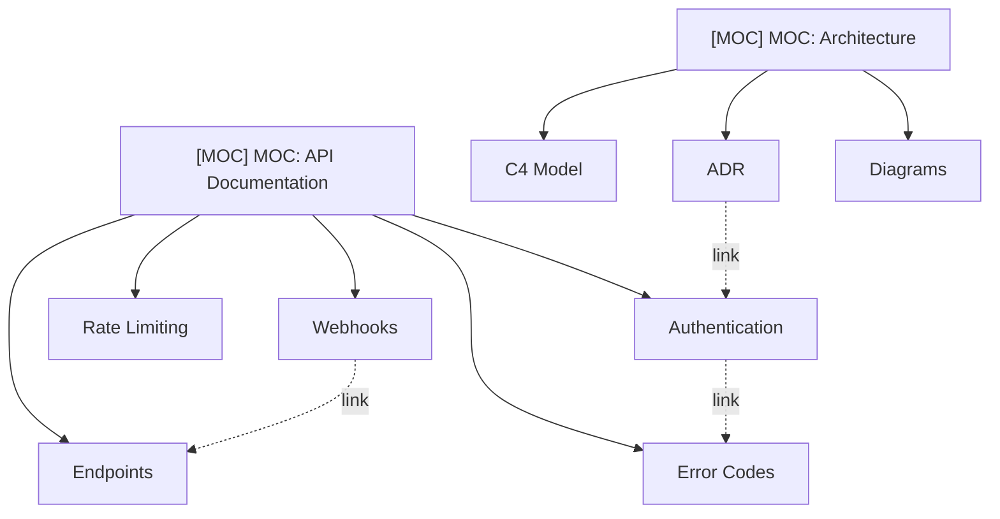

There are central "hub pages" (MOC — Map of Content) from which links radiate to detail pages. Each hub is a thematic index that brings together all links on one topic. This is the most practical hybrid: the structure of hierarchy at the top level (hubs) and the freedom of a network inside (links).

## Characteristics

| Aspect | Description |
|--------|-------------|
| Structure | Hybrid: hubs (hierarchy) + internal links (network) |
| Flexibility | Medium — hub hierarchy, freedom inside |
| Scalability | High — new hubs can be added |
| Maintenance Complexity | Medium — need to maintain hubs |

## Visualization



## Pros

- **Balance of structure and freedom** — there are clear entry points (hubs), but inside — a flexible network of links
- **Convenient entry into a topic** through a hub — a newcomer opens the MOC and sees all related pages
- **Backlinks show context** — you can see which hubs link to a page
- **Easy to add new pages** — without breaking navigation, just add a link to the hub

## Cons

- **Need to manually keep hubs up to date** — if you forget to add a link to the MOC, the page "disappears"
- **Hubs can become outdated** and mislead — the link exists, but the page is no longer relevant
- **No automatic categorization** — hubs are manual work

## Examples

The approach is popular in the Obsidian/PKM community (MOC — Map of Content). Many also use it in corporate documentation.

## Hub Example

```markdown
# API Documentation (MOC)

## Authentication
- [[Authentication]] — overview of authorization methods
- [[OAuth Setup]] — OAuth 2.0 configuration
- [[API Keys]] — key management

## Endpoints
- [[Endpoints]] — complete list of REST endpoints
- [[Rate Limiting]] — request limits
- [[Error Codes]] — error codes and their descriptions
```

**Tip:** In MkDocs, index pages of sections serve as MOCs. They contain a summary table and links to all pages in the section — the same hub principle.
