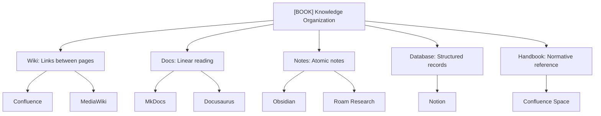

Wiki and Docs are not the same thing. They are different paradigms for working with information, and understanding the differences is critical for choosing a platform. Before choosing a tool, you need to understand what problem you are actually solving.

## Paradigms Map

## Classification by Paradigm

| Paradigm | Essence | Navigation | Author Role | Typical Tool |
|----------|---------|------------|-------------|--------------|
| **Wiki** | Interconnected pages via links, open editing | By links and backlinks | Co-author, editor | Confluence, MediaWiki |
| **Docs** | Linear structured documents (guides, manuals) | By table of contents and hierarchy | Writer, reviewer | MkDocs, Docusaurus |
| **Notes** | Personal quick notes, atomic thoughts | Search, tags, backlinks | Personal archive | Obsidian, Roam Research |
| **Database** | Structured records, tables, filters | Filters, sorting, views | Data curator | Notion, Airtable |
| **Handbook** | Normative reference: policies, procedures, onboarding | By regulation and index | Editor, approver | Confluence Space, SharePoint |

**Paradigms overlap:** Notion combines Wiki, Docs, and Database. Confluence is both Wiki and Handbook. MkDocs is pure Docs. The choice of platform is often determined by which paradigm dominates your workflow.
