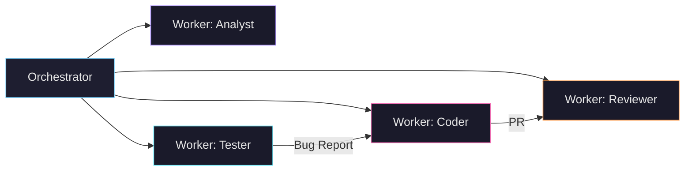

## Зачем этот файл

Этот файл — **верификация шаблона** реальным контентом из репозитория [StsDev-Wiki](https://github.com/stsgs1980/StsDev-Wiki). Каждая секция ниже содержит подлинный контент из базы знаний и проверяет конкретный элемент рендеринга.

> Если всё рендерится корректно — шаблон готов к приёму документации.

---

## Текст: параграфы, жирный, курсив, inline-код

**Мы побеждаем если взялись.** Не "попробуем". Не "посмотрим что получится". *Взялись — довели до конца.* Это applies to every skill, every feature, every fix, every project. Done is better than perfect, but "almost done" is not done.

Инцидент 2026-05-30: отчёт "Комплексный анализ системы" по Zai-agent-toolkit содержал 10 "найденных" файлов. Ни один не существовал в репозитории. Точность: **0%**. Результат: ~1 потерянная неделя. Именно поэтому принцип `анти-галлюцинация` — вечный и не пересматривается.

---

## Списки

### Ненумерованный

Ключевые технические преимущества перед конкурентами:

- **Skill SDK с ID-системой** — уникальный ID `ZAI-<DOMAIN>-<NUMBER>`, cross-reference checker
- **Quality Engine (SonarMAS)** — 6-dimension heuristic scoring + LLM evaluation
- **Scanner** — format-independent parser, 140 файлов за 2 секунды
- **Anti-Monolith архитектура** — каждый модуль не более 150 строк
- **Progressive Disclosure (L1/L2/L3)** — оптимизация token usage

### Нумерованный

Протокол перед любым анализом:

1. `git clone` / `git pull` — получить актуальный код
2. `find . -type f` — полный список файлов
3. Прочитать каждый файл, на который будешь ссылаться
4. Каждое утверждение проверить по прочитанному
5. Файл не найден — НЕ придумывать. Написать: "не найден"

---

## Таблица: конкуренты

| Конкурент | Что делают | Чего НЕ делают (наш шанс) |
|-----------|-----------|---------------------------|
| **Anthropic** | MCP protocol, Claude tool-use API, JSON Schema для tools | Нет skill-формата, нет quality scoring для toolkits |
| **LangChain** | Python tool wrappers, chain composition, @tool decorator | Нет skill-файлов, нет ID-системы, нет cross-reference checking |
| **Dify** | Visual workflow builder, prebuilt agent templates, SaaS | Нет custom skill SDK, нет scanner/validator |
| **n8n** | Workflow automation, 400+ integration nodes | Не agent-oriented, no skill ecosystem |
| **Flowise** | No-code LLM flow builder, drag-and-drop | No code ownership, no skill management |

---

## Таблица: статусы экосистемы

| Статус | Кол-во | Примеры |
|--------|--------|---------|
| ACTIVE | 8 | P-MAS-architector, 3A Studio, UI-Kit |
| FROZEN | 1 | 3a-studio (остановлен 30.05.2026) |
| NEW | 4 | Code-Realm, HH-Job-Copilot, CHROMEDNA |
| REFERENCE | 1 | Zai-agent-toolkit (read-only) |
| ARCHIVED | 3 | P-mas-studio, MVP-Flow-Studio-Pro |

---

## Блок кода: TypeScript

```typescript
// S-04: React компоненты — стандарт экосистемы
interface AgentNode {
  id: string;
  role: 'orchestrator' | 'worker' | 'reviewer';
  skills: string[];
  parentId?: string;
  config: {
    model: string;
    temperature: number;
    maxTokens: number;
  };
}

function buildAgentHierarchy(nodes: AgentNode[]): Map<string, AgentNode[]> {
  const hierarchy = new Map<string, AgentNode[]>();
  for (const node of nodes) {
    const key = node.parentId || '__root__';
    if (!hierarchy.has(key)) hierarchy.set(key, []);
    hierarchy.get(key)!.push(node);
  }
  return hierarchy;
}
```

---

## Блок кода: SQL (FTS5)

```sql
-- SQLite FTS5 — выбран вместо ChromaDB для MVP
-- Причина: чистый Next.js, нет Python-зависимостей
CREATE VIRTUAL TABLE memories USING fts5(
  title,
  content,
  tags,
  source,
  tokenize='porter unicode61'
);

-- Поиск с ранжированием
SELECT title, snippet(memories, 2, '<<', '>>', '...', 32) as fragment
FROM memories
WHERE memories MATCH 'multi-agent orchestration'
ORDER BY rank
LIMIT 10;
```

---

## Блок кода: Bash

```bash
# Протокол проверки анти-галлюцинации
git clone https://github.com/stsgs1980/3a-studio.git /tmp/audit
cd /tmp/audit
find . -type f -name "*.ts" -o -name "*.tsx" | wc -l
# Проверить: упомянутый файл существует?
find . -name "agent-hierarchy.tsx"
```

---

## Блок кода: без подсветки (plain)

```
MVP (SQLite):
  Upload -> API route -> parse doc -> store full text in SQLite
  Search -> API route -> SQLite FTS5 (full-text search)

Продакшен (PostgreSQL):
  Upload -> API route -> parse doc -> store full text in PostgreSQL
                                  -> generate embeddings -> store in pgvector
  Search -> API route -> SQL full-text + vector similarity (pgvector)
```

---

## Mermaid-диаграмма: архитектура monorepo

```mermaid
graph TD
    A[3a-studio monorepo] --> B[app/ — Next.js 16]
    A --> C[packages/]

    B --> B1[(auth)/]
    B --> B2[editor/ — Flow Editor]
    B --> B3[agents/ — Agent Management]
    B --> B4[prompt-studio/]
    B --> B5[skills/ — Skill Forge]
    B --> B6[api/]

    C --> C1[@stsgs/ui — дизайн-система]
    C --> C2[@stsgs/prompting — оценки]
    C --> C3[@stsgs/shared — типы]
    C --> C4[eslint-plugin-3a]

    C2 --> C2a[scoring/ — 6 критериев]
    C2 --> C2b[formulas/ — 20 формул]
    C2 --> C2c[frameworks/ — RTF, CO-STAR]

    C1 --> B2
    C3 --> B
    C2 --> B4
    C2 --> B5
```

---

## Mermaid-диаграмма: иерархия агентов



---

## Callout: информация

<Callout type="info" title="Иерархия стандартов">
**Принципы** (почему) → **Правила** (что) → **Стандарты** (как). Стандарты детализируют правила, но не повторяют принципы. Авторитетный источник стандартов — эта wiki, не Zai-agent-toolkit (сырой, 46 багов).
</Callout>

---

## Callout: предупреждение

<Callout type="warning" title="Красные флаги галлюцинации">
Если в отчёте появляются `.js` файлы в TypeScript проекте, имена вроде `*_service`, `*_controller` без конкретных путей, или красиво оформленный текст с нулём проверяемых фактов — это галлюцинация. Действие: возврат к протоколу.
</Callout>

---

## Callout: совет

<Callout type="tip" title="Quick check">
Если нужно быстро понять что активно в экосистеме — смотри статусы [ACTIVE] и [NEW]. Это 11 проектов с реальным кодом и развитием.
</Callout>

---

## Callout: опасность

<Callout type="danger" title="Галлюцинированный отчёт">
Выбросить. Не исправлять. Не дополнять. Исправлять нечего — там нет верных фактов. Правильный анализ начинается с чтения файлов.
</Callout>

---

## Бейджи

Технологии: <Badge>Next.js 16</Badge> <Badge>React 19</Badge> <Badge>Prisma</Badge> <Badge>SQLite</Badge>

Статусы: <Badge variant="success">ACTIVE</Badge> <Badge variant="warning">NEW</Badge> <Badge variant="danger">ARCHIVED</Badge> <Badge variant="default">REFERENCE</Badge>

---

## Цитата

> **Если нужно быстро понять что живо** — смотри ACTIVE и NEW. Это 11 проектов, где есть реальный код и развитие.
>
> — [Карта экосистемы](/docs/karta-ekosistemy/)

---

## Изображение


---

## Внутренние ссылки

Навигация по связанным страницам шаблона:

- [Об авторе](/docs/ob-avtore/) — кто строит, стек, подход
- [Карта экосистемы](/docs/karta-ekosistemy/) — все 55 репозиториев
- [Vision & Goals](/docs/vision-goals/) — конкуренты, преимущества, milestones
- [Анти-галлюцинация](/docs/anti-gallyutsinatsiya/) — вечный принцип
- [Стандарты кода](/docs/standarty-koda/) — S-01 ... S-08

---

## Внешние ссылки

- [StsDev-Wiki на GitHub](https://github.com/stsgs1980/StsDev-Wiki) — исходный репозиторий
- [Next.js Documentation](https://nextjs.org/docs) — фреймворк шаблона
- [MDX Specification](https://mdxjs.com/) — формат контента
- [Mermaid.js](https://mermaid.js.org/) — диаграммы

---

## Блок кода: конфигурация (YAML-like)

```yaml
# verify-docs — data-driven проверка консистентности
rules:
  - name: "readme-matches-code"
    severity: "error"
    check: "files_count in README === actual files_count"

  - name: "no-duplicate-ids"
    severity: "warning"
    check: "skill IDs are unique across all files"

  - name: "cross-references-resolve"
    severity: "error"
    check: "every STD-ID and ZAI-ID referenced exists"
```

---

## Итого: чеклист верификации

| Элемент | Статус |
|---------|--------|
| Заголовки h2, h3, h4 | Проверить визуально |
| Параграфы, жирный, курсив | Проверить выше |
| Inline-код (\`...\`) | Проверить выше |
| Ненумерованные и нумерованные списки | Проверить выше |
| Таблицы (2+, много колонок) | Проверить выше |
| Блоки кода (TypeScript, SQL, Bash, plain) | Проверить выше |
| Mermaid-диаграммы (2 шт) | Проверить выше |
| Callout (info, warning, tip, danger) | Проверить выше |
| Badge (4 варианта) | Проверить выше |
| Блок-цитата | Проверить выше |
| Изображение | Проверить выше |
| Внутренние ссылки (Next.js Link) | Проверить кликом |
| Внешние ссылки (target=_blank) | Проверить кликом |
| Горизонтальные разделители | Проверить визуально |