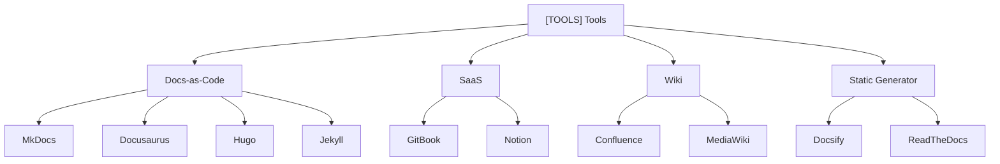

An overview of the main tools for creating and publishing documentation. A tool is the implementation of a paradigm: MkDocs implements Docs-as-Code, GitBook implements SaaS, Confluence implements a corporate Wiki.

## Tools Map

## Summary Table

| Tool | Type | Feature | Best For |
|------|------|---------|----------|
| MkDocs | Docs-as-Code (Python) | Static generator, Material theme | Developers, DevOps |
| GitBook | SaaS | WYSIWYG editor, team collaboration | Product managers, tech writers |
| Docusaurus | Docs-as-Code (React) | From Meta, MDX + React components | Open source, React teams |
| Hugo | Static Generator | Very fast, written in Go | Large sites, blogs |
| Confluence | Corporate Wiki | Atlassian ecosystem, Jira integration | Enterprise |
| Notion | SaaS Wiki | Databases, flexibility, team collaboration | Startups, small teams |
| ReadTheDocs | Hosting + CI | Auto-build from GitHub, free for OSS | Open source |
| Jekyll | Static Generator | Default for GitHub Pages, Ruby | Simple projects |
| Docsify | Docs-as-Code (runtime) | No generation — renders Markdown on the fly | Quick prototypes |

**How to choose a tool:** Do not start with a tool — start with a paradigm and an approach. A tool is the implementation, not the starting point.
