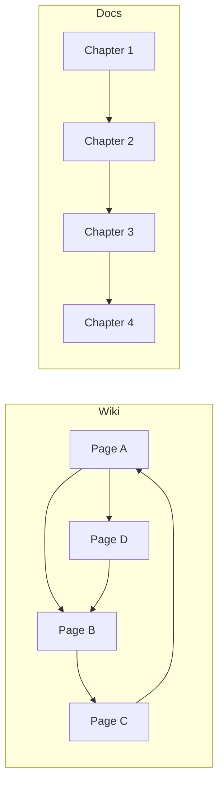

This is a key distinction that is often missed when choosing a platform. Wiki and Docs are not different tools — they are different paradigms for working with information. Understanding this distinction determines which tool and structure you will choose.

## Comparison

| Aspect | Wiki | Docs |
|--------|------|------|
| Reading model | Non-linear — jumping by links | Linear — reading top to bottom |
| Structure | Network — pages are equal | Hierarchical — chapters and sections |
| Authorship | Collective — anyone can edit | Regulated — author and reviewer |
| Goal | Connect knowledge | Convey knowledge sequentially |
| Audience | Team members | Readers (clients, newcomers) |
| Examples | Wikipedia, Confluence Wiki | ReadTheDocs, MkDocs site |

## Visualization

Wiki is a network where you can jump in any order. Docs is a book where you read sequentially.

## Notion-Style: Platform Unifies Paradigms

Modern platforms (Notion, Coda, Anytype) combine multiple paradigms in one interface:

| Paradigm | Implementation in Notion |
|----------|--------------------------|
| Doc | Page with text, headings, blocks |
| Wiki | Space with backlinks |
| Project | Boards, task tracking, kanban |
| Database | Tables, kanban view, calendar, gallery |

**Which to choose?** If your team **looks for information** by connections (like Wikipedia) — you need a Wiki. If you **teach** people (like a textbook) — you need Docs. Often you need both — then Hub-and-Spoke provides a hybrid.
